# git的一些基本用法

> 简单讲一下什么是git
> git是一个用来保存不同版本的工具
> github是一个平台，使用git工具可以把代码（泛指一切小于100Mb的文件，当然，最好小于50Mb）上传到上面

## 概念分析
1. **仓库**：就是github上一个储存你代码的地方，当然也储存了你的修改和提交代码的记录
2. **提交**：把本地的版本的代码上传到仓库，覆盖旧版本，但是会在仓库留下记录，方便你找回曾经的版本
3. **拉取**：别人在仓库修改了代码，你通过拉取仓库的新代码，覆盖本地的代码
4. **ssh(secure shell)**：ssh是一种网络协议，为的是让本地和和服务器建立加密隧道，可以安全地传输数据
   

**给个基本原理图：**
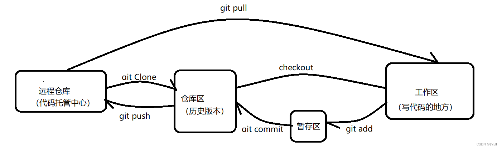

***详细讲解ssh在github配置的原理***
ssh验证流程
1. 生成一对密钥（公钥和私钥）
2. 将公钥添加到服务器（GitHub）
3. 通信时验证

你可以把ssh理解成一个方法，建立了一种传递数据的固有方式。数据被存在一个保险箱中。打开这个保险箱有两把钥匙，一把是你的（私钥），一把是给服务器的（公钥）。这样你们传输的时候就可以直接传输过去（当然密钥的功能是为了互相验证，而不是加密解码）

***为什么要先拉取后上传？***
因为你要先把别人的修改先保存到本地，否则你先上传自己的老版的会将别人的新版的覆盖，造成冲突

## 使用git上传代码到github的方法
### 基本配置
1. 首先对于一个Windows用户，我们需要安装git
   此时，我们贴上链接：https://git-scm.com/
   理论上选择这个:
   

2. 点击安装即可
   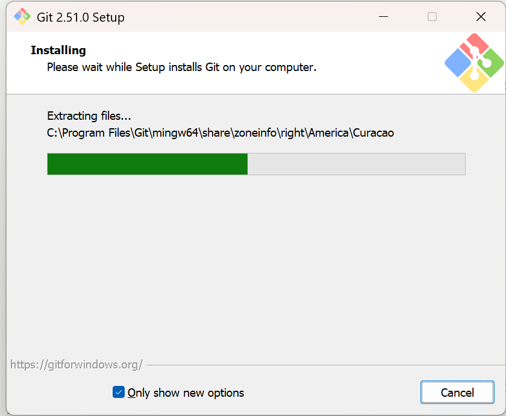

3. 安装完成界面，点击finish即可
   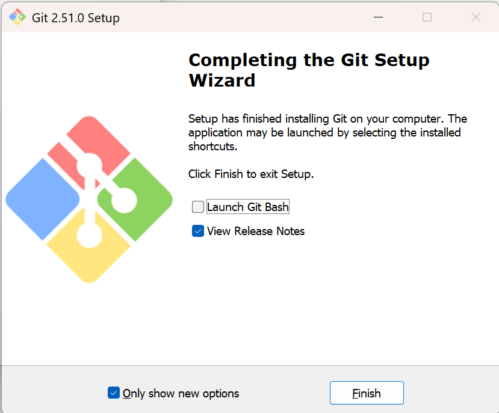

4. 随便打开一个盘，我个人不太喜欢分盘，因为分盘没有意义。当然按照普罗大众的标准，我分出了D盘，在图形界面下，右击鼠标，选择**显示更多选项**
   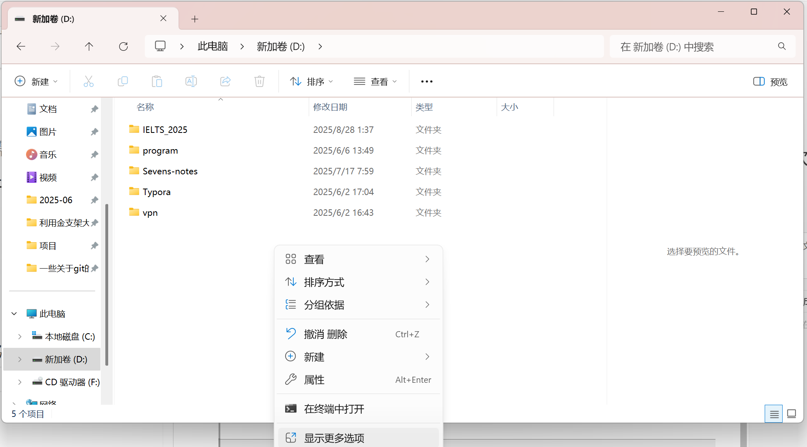

5. 点击**Open Git Bash here**. bash，你就理解成命令吧
   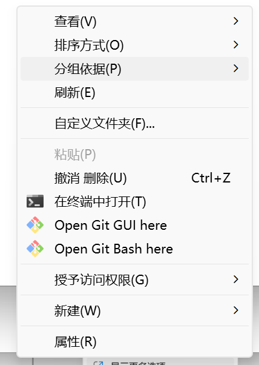

6. 进入这个界面，ctrl+可以放大字体，ctrl-可以缩小字体，自己舒服就行
   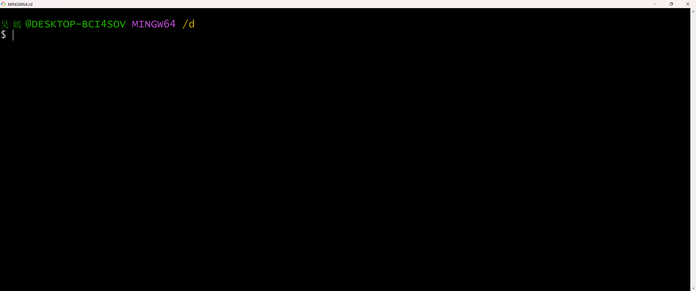
   这个界面表明你在d盘下，头一次使用，开始配置一些参数（后面的代码直接输入就行，一行一行打，井号后面请忽略，那是注释）
   1. 
   ```bash
   cd ～/.ssh  #检查是否已经存在ssh
   ```
   理论上是不存在的，但是看看吧
   2. 
    ```bash
    ssh-keygen -t rsa -C xxxxx@xxxx.com # 这里的邮箱请写你注册github的邮箱地址
    # 出现第一个提示请直接回车，这里代表密钥储存地址，默认即可
    # 第二个第三个会提示输入密码，直接回车就行，设置密码后面有点麻烦
    ```
    如果ssh配置成功，会出现以下标志：
    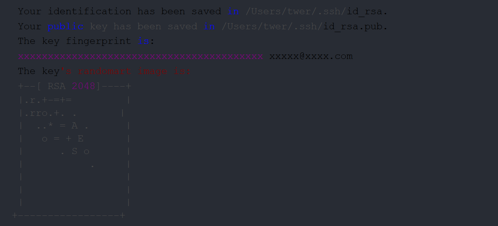
    3. 复制一下那个public key保存的地址
    ```bash
    cat 保存的地址 # 这里把地址复制一下就好，记住在这个bash里面复制粘贴不是ctrl c ctrl v，直接右键复制粘贴就好
    # 记得地址含id_rsa.pub. (这是公钥的意思，public)
    # 此时，你的终端会出现这么一堆乱七八糟的码
    # ssh-rsa AAAAB3NzaC1yc2EAAAADAQABAAABAQDAR+fdAAGdaRG8J1M+JpkjSOnMMyVee7Lq5BaABZpdCRaKgYWLlSLkEYjXZelXkdT2yZImb41fjqCvzZkzhzK0GnldY8xD5umCmkjOY2eF0kjR0y7ZLU/bLtt5tA6niVz49MKSBTgsjYVBcyv16oNcUa9sOKPjgv7EDIznWjvAOWJaH4eDbpoFAMz8wHWnOpOchJDI3WLZ7OFKW5/Wj5d0TVVt9KnU0ZCwZGRfPmVEQC1chKw8ePicNJtJrtyw0VlNgRoZev67aTvZICQx7uLOmNa78tNEfZSeyupByDbr6jEpIFLxZHmvbPM4TDZi/UnDf+Z1jQjYplkzjiyU2lr/ xxxxxxx@qq.com
    # 不用管他，把这些码复制好
    ```

7. 现在开始github的配置，打开github网页，贴在这里 github.com
   1. 进入登陆好的主页，点击自己的头像，点击**settings**
   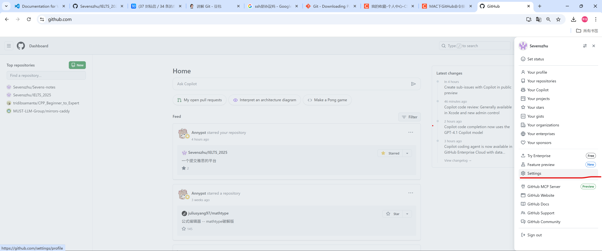
   2. 点击**SSH and GPG keys**
   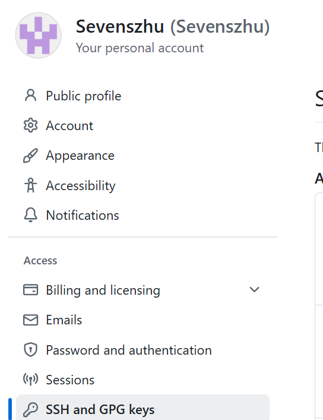
   3. 点击**New SSH Key**
   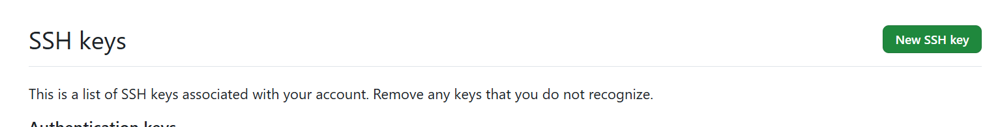
   4. title胡恰一个，这个东西代表这是你的哪一台电脑，你自己知道就行，下面的Key把复制的东西粘贴上去，点击**Add SSH Key**
   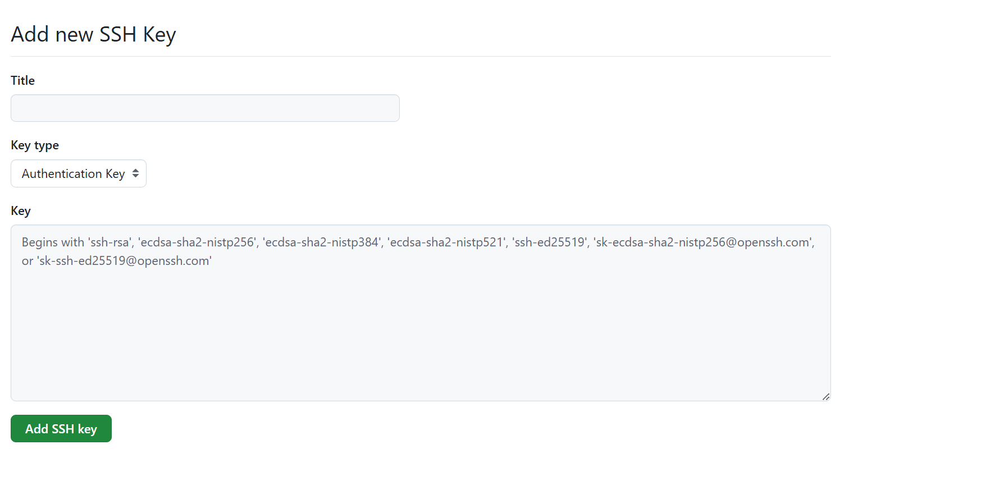

8. 
    ```bash
    ssh -T git@github.com
    # 尝试连接官网服务器
    # 如果出现以下提示，说明连接成功
    # Hi HaleyHan! You've successfully authenticated, but GitHub does not provide shell access.
    ```

9. 后面开始初始化操作
    ```bash
    git config --global user.name 你的名字 # 设置用户签名
    git config --global user.email 你的邮箱地址 # 设置邮箱地址
    # 这俩玩意只要首次配置就好了
    ```

10. 这时候就基本配置完成了

### 仓库的创建

现在教学一下仓库的创建

现在回到主界面

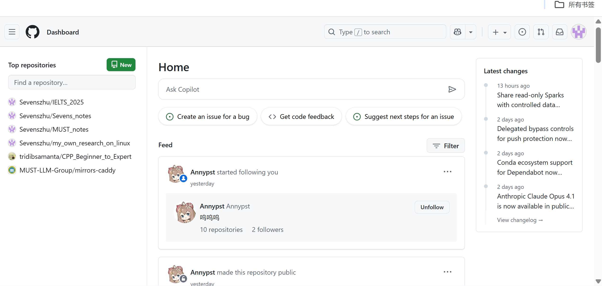

点击自己的头像

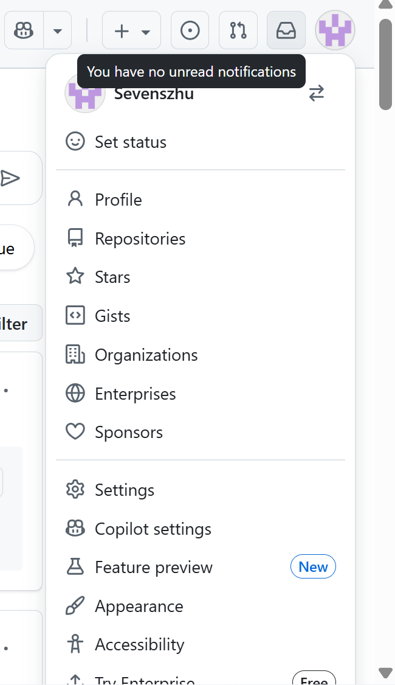

选择**Repositories**

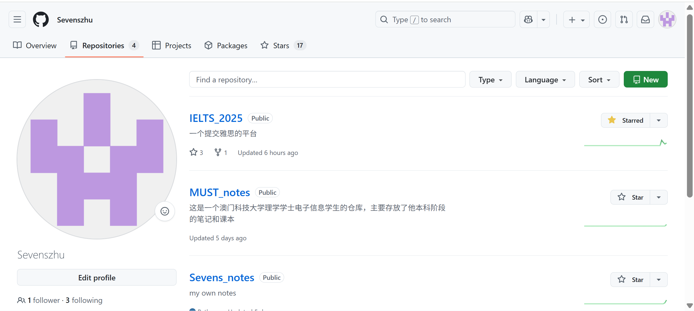

点击**New**


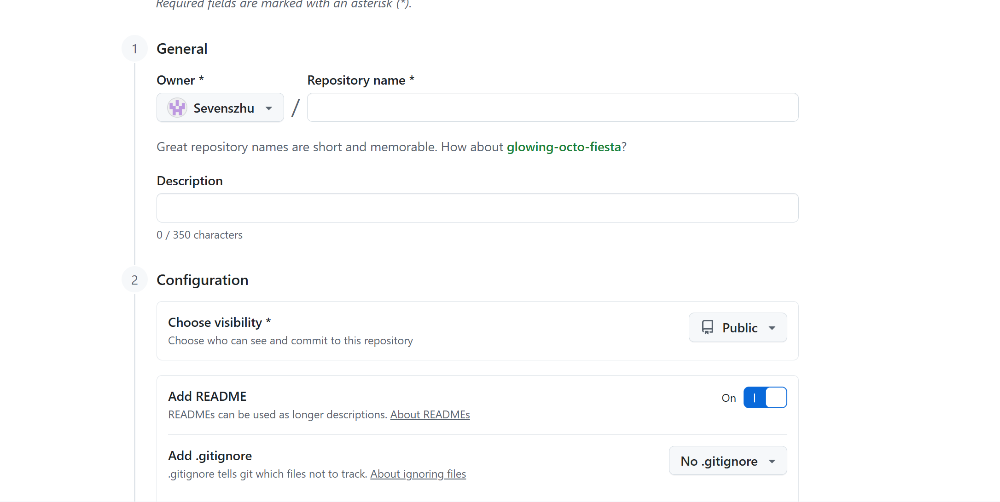

**记得打开add README** （README就是读我的意思，是介绍性文件，用md语言写）

### 克隆仓库到本地

所谓的克隆仓库，代表你本地没有这个仓库内代码的任何版本，所以只有你第一次获取一个仓库才需要克隆。
在GitHub中查看,如图，点击**Code**， **SSH**，复制那个链接，每个人的链接都是独一无二的
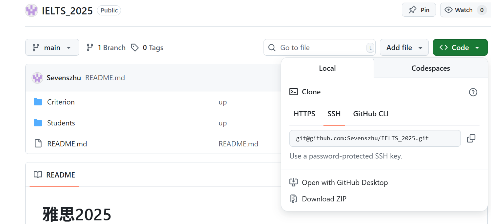
打开命令行(按照上面写的操作) 
```bash
git clone 复制得到的链接 # 这一步可以把你的仓库获取到本地，时间可能比较久，ssh比较稳定，基本上什么网络条件都可以适配
```
后续你可以肆意对仓库修改
### 先拉取，后上传
做出更改后，往往需要同步到GitHub上
首先，你要打开仓库的最大的文件夹，譬如我的IELTS_2025就应该是最大的文件夹，在文件夹内打开终端
```bash
git pull origin main # 先获取别人的更改，避免冲突，这句话也可以随时用来更新本地的仓库
git add . # 懒得解释，.和..是linux的一些特有的东西，记住吧
git commit -m "你想写的备注" # 提交更改
git push origin main # 推送到GitHub
```
完事啦，你又学会了一项技能，恭喜