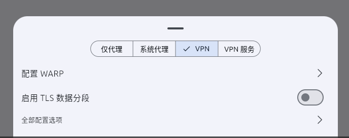

/*************************************************************************
 * @File Name: 突破网络封锁.md
 * @Description: 使用hiddify工具，利用github上别人提供的v2ray节点，在linux上实现突破网络封锁
 * @Author: SevensZhu
 * @Created Time: Wed 09 Jul 2025 08:55:27 AM CST
 ************************************************************************/

1. 首先，安装hiddify，这个直接在github上找就行了，建议使用deb包，不要使用appimage，给一个网站https://github.com/hiddify/hiddify-app ，下载

安装很简单，给个代码

```bash
sudo dpkg -i 软件名称.deb
```

等待一会就安装好了 。

2. 安装好之后，用超级管理员权限打开（目的是打开VPN模式）		

    ```bash
    sudo hiddify
    ```

    ​    

3. hiddify一共有四个模式: 仅代理（应用层面），系统代理（全系统层面），VPN （独立协议），VPN服务（通用协议）

    其实只有VPN可以用。

    - 点击这个按钮

    - 选择VPN模式

        

    **闲扯几句**： 

    - 很神奇的是，只有VPN可以用

    - hiddify正常也是可以打开的，但是由于VPN模式是实验室模式，需要管理员权限，所以只能这样打开
    - 原理分析：
        1. 可能是因为机制不同，VPN采用加密隧道，网络运营商难以检测。代理模式端口固定，协议头较为常见，容易被识别
        2. 代理模式可能与系统代理冲突， VPN强制转换。

4. 按这个按钮

    复制这个链接

    ```link
    https://raw.githubusercontent.com/aiboboxx/v2rayfree/main/v2
    ```

    点击这个（从剪切板添加）

    

就会自动配置好，然后点击连接就ok了

5. 更新订阅配置（为了更新节点，有些节点会被封禁）：

    点击最右端按钮

    弹出这个按钮：

    

点击**更新订阅**四个字，就好了
